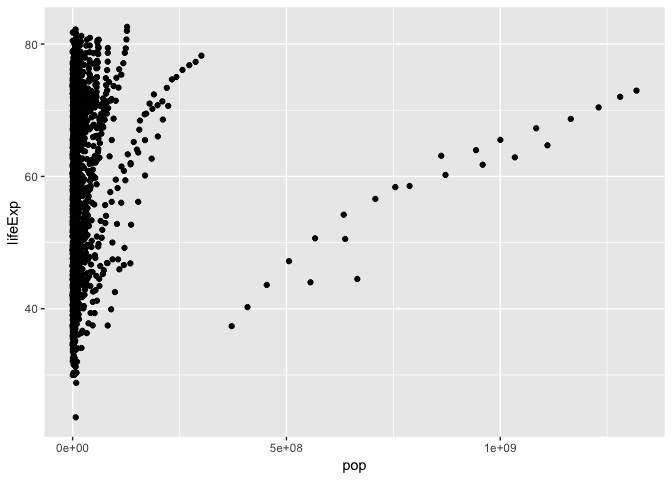
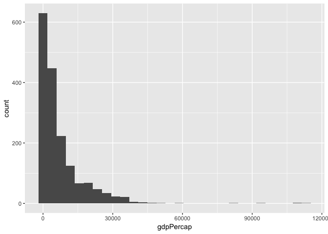
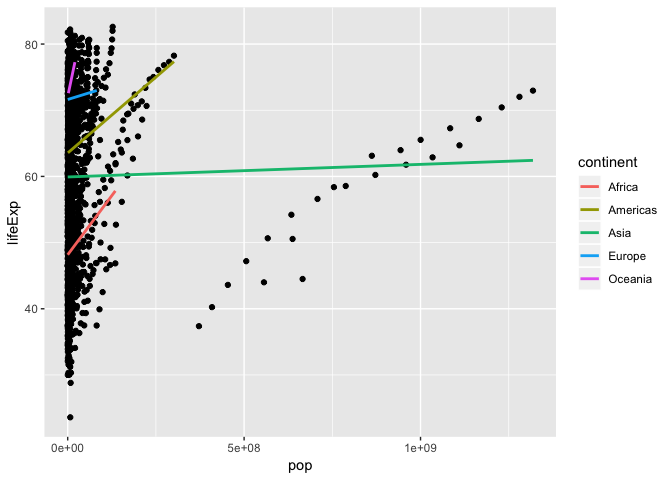
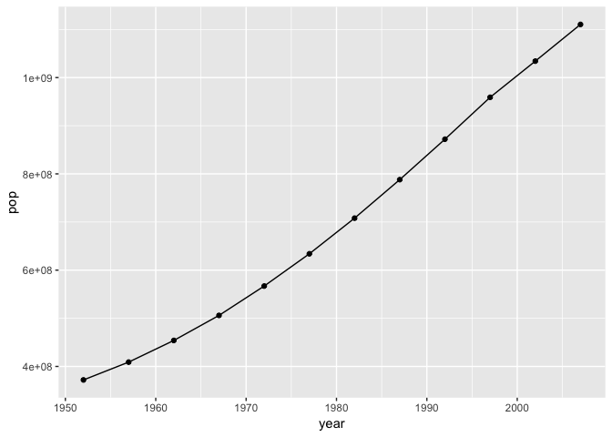
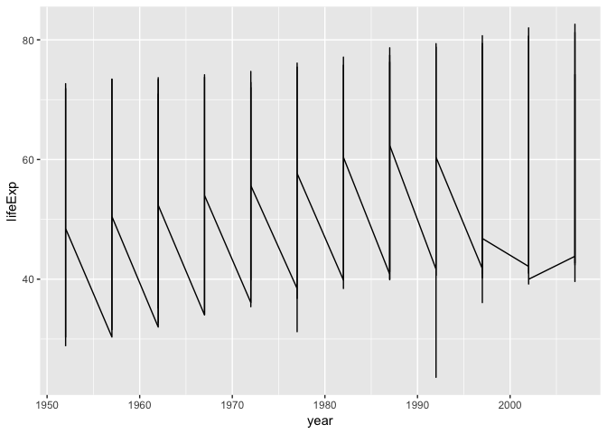
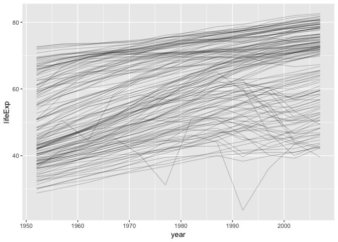

hw02-tsmith93
================
Thomas Smith
2018-09-19

Load gapminder and tidyverse

``` r
library(gapminder)
library(tidyverse)
```

    ## ── Attaching packages ─────────────────────────────────────────────── tidyverse 1.2.1 ──

    ## ✔ ggplot2 3.0.0     ✔ purrr   0.2.5
    ## ✔ tibble  1.4.2     ✔ dplyr   0.7.6
    ## ✔ tidyr   0.8.1     ✔ stringr 1.3.1
    ## ✔ readr   1.1.1     ✔ forcats 0.3.0

    ## ── Conflicts ────────────────────────────────────────────────── tidyverse_conflicts() ──
    ## ✖ dplyr::filter() masks stats::filter()
    ## ✖ dplyr::lag()    masks stats::lag()

What type of file?

``` r
class(gapminder)
```

    ## [1] "tbl_df"     "tbl"        "data.frame"

The function class (above) shows this is a tibble data frame, tibble, and a data frame

You can fin out the number of observations/rows and variable/collumns, respectively:

``` r
dim(gapminder)
```

    ## [1] 1704    6

This shows there are 6 collumns/variables and 1704 rows/observations

Alternatively, you can use individual functions to identify either number of rows:

``` r
nrow(gapminder)
```

    ## [1] 1704

Or collumns:

``` r
ncol(gapminder)
```

    ## [1] 6

You can also figure out what is the type of each variables individually:

``` r
class(gapminder$country)
```

    ## [1] "factor"

Or for all of them!

``` r
lapply(gapminder, class)
```

    ## $country
    ## [1] "factor"
    ## 
    ## $continent
    ## [1] "factor"
    ## 
    ## $year
    ## [1] "integer"
    ## 
    ## $lifeExp
    ## [1] "numeric"
    ## 
    ## $pop
    ## [1] "integer"
    ## 
    ## $gdpPercap
    ## [1] "numeric"

You can also look at the range of variables, whether they be categorical:

``` r
levels(gapminder$country)
```

    ##   [1] "Afghanistan"              "Albania"                 
    ##   [3] "Algeria"                  "Angola"                  
    ##   [5] "Argentina"                "Australia"               
    ##   [7] "Austria"                  "Bahrain"                 
    ##   [9] "Bangladesh"               "Belgium"                 
    ##  [11] "Benin"                    "Bolivia"                 
    ##  [13] "Bosnia and Herzegovina"   "Botswana"                
    ##  [15] "Brazil"                   "Bulgaria"                
    ##  [17] "Burkina Faso"             "Burundi"                 
    ##  [19] "Cambodia"                 "Cameroon"                
    ##  [21] "Canada"                   "Central African Republic"
    ##  [23] "Chad"                     "Chile"                   
    ##  [25] "China"                    "Colombia"                
    ##  [27] "Comoros"                  "Congo, Dem. Rep."        
    ##  [29] "Congo, Rep."              "Costa Rica"              
    ##  [31] "Cote d'Ivoire"            "Croatia"                 
    ##  [33] "Cuba"                     "Czech Republic"          
    ##  [35] "Denmark"                  "Djibouti"                
    ##  [37] "Dominican Republic"       "Ecuador"                 
    ##  [39] "Egypt"                    "El Salvador"             
    ##  [41] "Equatorial Guinea"        "Eritrea"                 
    ##  [43] "Ethiopia"                 "Finland"                 
    ##  [45] "France"                   "Gabon"                   
    ##  [47] "Gambia"                   "Germany"                 
    ##  [49] "Ghana"                    "Greece"                  
    ##  [51] "Guatemala"                "Guinea"                  
    ##  [53] "Guinea-Bissau"            "Haiti"                   
    ##  [55] "Honduras"                 "Hong Kong, China"        
    ##  [57] "Hungary"                  "Iceland"                 
    ##  [59] "India"                    "Indonesia"               
    ##  [61] "Iran"                     "Iraq"                    
    ##  [63] "Ireland"                  "Israel"                  
    ##  [65] "Italy"                    "Jamaica"                 
    ##  [67] "Japan"                    "Jordan"                  
    ##  [69] "Kenya"                    "Korea, Dem. Rep."        
    ##  [71] "Korea, Rep."              "Kuwait"                  
    ##  [73] "Lebanon"                  "Lesotho"                 
    ##  [75] "Liberia"                  "Libya"                   
    ##  [77] "Madagascar"               "Malawi"                  
    ##  [79] "Malaysia"                 "Mali"                    
    ##  [81] "Mauritania"               "Mauritius"               
    ##  [83] "Mexico"                   "Mongolia"                
    ##  [85] "Montenegro"               "Morocco"                 
    ##  [87] "Mozambique"               "Myanmar"                 
    ##  [89] "Namibia"                  "Nepal"                   
    ##  [91] "Netherlands"              "New Zealand"             
    ##  [93] "Nicaragua"                "Niger"                   
    ##  [95] "Nigeria"                  "Norway"                  
    ##  [97] "Oman"                     "Pakistan"                
    ##  [99] "Panama"                   "Paraguay"                
    ## [101] "Peru"                     "Philippines"             
    ## [103] "Poland"                   "Portugal"                
    ## [105] "Puerto Rico"              "Reunion"                 
    ## [107] "Romania"                  "Rwanda"                  
    ## [109] "Sao Tome and Principe"    "Saudi Arabia"            
    ## [111] "Senegal"                  "Serbia"                  
    ## [113] "Sierra Leone"             "Singapore"               
    ## [115] "Slovak Republic"          "Slovenia"                
    ## [117] "Somalia"                  "South Africa"            
    ## [119] "Spain"                    "Sri Lanka"               
    ## [121] "Sudan"                    "Swaziland"               
    ## [123] "Sweden"                   "Switzerland"             
    ## [125] "Syria"                    "Taiwan"                  
    ## [127] "Tanzania"                 "Thailand"                
    ## [129] "Togo"                     "Trinidad and Tobago"     
    ## [131] "Tunisia"                  "Turkey"                  
    ## [133] "Uganda"                   "United Kingdom"          
    ## [135] "United States"            "Uruguay"                 
    ## [137] "Venezuela"                "Vietnam"                 
    ## [139] "West Bank and Gaza"       "Yemen, Rep."             
    ## [141] "Zambia"                   "Zimbabwe"

Or quantitative:

``` r
range(gapminder$lifeExp)
```

    ## [1] 23.599 82.603

Here is a summary of the data, including distribution:

``` r
summary(gapminder)
```

    ##         country        continent        year         lifeExp     
    ##  Afghanistan:  12   Africa  :624   Min.   :1952   Min.   :23.60  
    ##  Albania    :  12   Americas:300   1st Qu.:1966   1st Qu.:48.20  
    ##  Algeria    :  12   Asia    :396   Median :1980   Median :60.71  
    ##  Angola     :  12   Europe  :360   Mean   :1980   Mean   :59.47  
    ##  Argentina  :  12   Oceania : 24   3rd Qu.:1993   3rd Qu.:70.85  
    ##  Australia  :  12                  Max.   :2007   Max.   :82.60  
    ##  (Other)    :1632                                                
    ##       pop              gdpPercap       
    ##  Min.   :6.001e+04   Min.   :   241.2  
    ##  1st Qu.:2.794e+06   1st Qu.:  1202.1  
    ##  Median :7.024e+06   Median :  3531.8  
    ##  Mean   :2.960e+07   Mean   :  7215.3  
    ##  3rd Qu.:1.959e+07   3rd Qu.:  9325.5  
    ##  Max.   :1.319e+09   Max.   :113523.1  
    ## 

Specific summary statistics can also be shown, such as the mean of each variable:

``` r
lapply(gapminder, mean)
```

    ## Warning in mean.default(X[[i]], ...): argument is not numeric or logical:
    ## returning NA

    ## Warning in mean.default(X[[i]], ...): argument is not numeric or logical:
    ## returning NA

    ## $country
    ## [1] NA
    ## 
    ## $continent
    ## [1] NA
    ## 
    ## $year
    ## [1] 1979.5
    ## 
    ## $lifeExp
    ## [1] 59.47444
    ## 
    ## $pop
    ## [1] 29601212
    ## 
    ## $gdpPercap
    ## [1] 7215.327

Next we can plot some of these variables. To start off, we will do a scatterplot of two variables. But before then, it is always good practice to make a grammar component table:

| Grammar Component     | Specification |
|-----------------------|---------------|
| **data**              | `gapminder`   |
| **aesthetic mapping** | `x`and `y`    |
| **geometric object**  | point         |
| scale                 | linear        |
| statistical transform | none          |
| coordinate system     | rectangular   |
| facetting             | none          |

``` r
ggplot(gapminder, aes(x=lifeExp, y=pop)) + 
    geom_point()
```



We can also present data for one quantitative variable using plots such as histograms:

| Grammar Component     | Specification |
|-----------------------|---------------|
| **data**              | `gapminder`   |
| **aesthetic mapping** | `x`           |
| **geometric object**  | histogram     |
| scale                 | linear        |
| statistical transform | none          |

``` r
ggplot(gapminder, aes(gdpPercap)) +
    geom_histogram()
```

    ## `stat_bin()` using `bins = 30`. Pick better value with `binwidth`.



Finally, we can plot quantitative and categorical data together. A popular choice for this is a boxplot:

| Grammar Component     | Specification    |
|-----------------------|------------------|
| **data**              | `gapminder`      |
| **aesthetic mapping** | `x` and `y`      |
| **geometric object**  | boxplot          |
| scale                 | log-y scale      |
| statistical transform | 5-number summary |

``` r
a <- ggplot(gapminder, aes(continent, lifeExp)) +
  scale_y_log10()
a
```



We are also able to filter our data in order to plot data in a more precise way:

``` r
select(gapminder, country, year, lifeExp)
```

    ## # A tibble: 1,704 x 3
    ##    country      year lifeExp
    ##    <fct>       <int>   <dbl>
    ##  1 Afghanistan  1952    28.8
    ##  2 Afghanistan  1957    30.3
    ##  3 Afghanistan  1962    32.0
    ##  4 Afghanistan  1967    34.0
    ##  5 Afghanistan  1972    36.1
    ##  6 Afghanistan  1977    38.4
    ##  7 Afghanistan  1982    39.9
    ##  8 Afghanistan  1987    40.8
    ##  9 Afghanistan  1992    41.7
    ## 10 Afghanistan  1997    41.8
    ## # ... with 1,694 more rows

Alternatively, filter:

``` r
filter(gapminder, lifeExp>34)
```

    ## # A tibble: 1,680 x 6
    ##    country     continent  year lifeExp      pop gdpPercap
    ##    <fct>       <fct>     <int>   <dbl>    <int>     <dbl>
    ##  1 Afghanistan Asia       1967    34.0 11537966      836.
    ##  2 Afghanistan Asia       1972    36.1 13079460      740.
    ##  3 Afghanistan Asia       1977    38.4 14880372      786.
    ##  4 Afghanistan Asia       1982    39.9 12881816      978.
    ##  5 Afghanistan Asia       1987    40.8 13867957      852.
    ##  6 Afghanistan Asia       1992    41.7 16317921      649.
    ##  7 Afghanistan Asia       1997    41.8 22227415      635.
    ##  8 Afghanistan Asia       2002    42.1 25268405      727.
    ##  9 Afghanistan Asia       2007    43.8 31889923      975.
    ## 10 Albania     Europe     1952    55.2  1282697     1601.
    ## # ... with 1,670 more rows

Another way is to use piping:

``` r
gapminder %>% 
  filter(lifeExp<30)
```

    ## # A tibble: 2 x 6
    ##   country     continent  year lifeExp     pop gdpPercap
    ##   <fct>       <fct>     <int>   <dbl>   <int>     <dbl>
    ## 1 Afghanistan Asia       1952    28.8 8425333      779.
    ## 2 Rwanda      Africa     1992    23.6 7290203      737.

Now, why don't we apply filters to `ggplot()`!

| Grammar Component     | Specification |
|-----------------------|---------------|
| **data**              | `gapminder`   |
| **aesthetic mapping** |               |
| **geometric object**  |               |
| scale                 |               |
| statistical transform |               |

``` r
gapminder %>% 
 filter(country == "India") %>% 
 ggplot(aes(year, pop)) +
 geom_line() +
 geom_point()
```



Or we can even plot the same information for multiple countries at the same time:

``` r
c <- ggplot(gapminder, aes(year, lifeExp))
c + geom_line()
```



``` r
c + geom_line(aes(group=country), alpha=0.2)
```



Now for some extra fun, lets evaluate this data line where the author was hoping to get data only from Afghanistan and Rwanda.

``` r
filter(gapminder, country == c("Rwanda", "Afghanistan"))
```

    ## # A tibble: 12 x 6
    ##    country     continent  year lifeExp      pop gdpPercap
    ##    <fct>       <fct>     <int>   <dbl>    <int>     <dbl>
    ##  1 Afghanistan Asia       1957    30.3  9240934      821.
    ##  2 Afghanistan Asia       1967    34.0 11537966      836.
    ##  3 Afghanistan Asia       1977    38.4 14880372      786.
    ##  4 Afghanistan Asia       1987    40.8 13867957      852.
    ##  5 Afghanistan Asia       1997    41.8 22227415      635.
    ##  6 Afghanistan Asia       2007    43.8 31889923      975.
    ##  7 Rwanda      Africa     1952    40    2534927      493.
    ##  8 Rwanda      Africa     1962    43    3051242      597.
    ##  9 Rwanda      Africa     1972    44.6  3992121      591.
    ## 10 Rwanda      Africa     1982    46.2  5507565      882.
    ## 11 Rwanda      Africa     1992    23.6  7290203      737.
    ## 12 Rwanda      Africa     2002    43.4  7852401      786.

It appears they did so correctly!

TA DA, done... almost...
